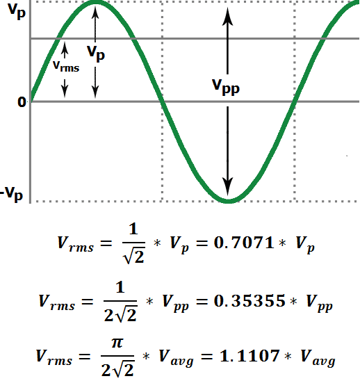
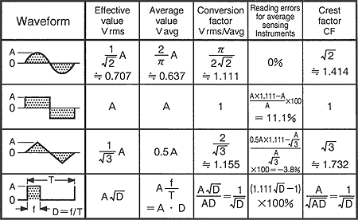
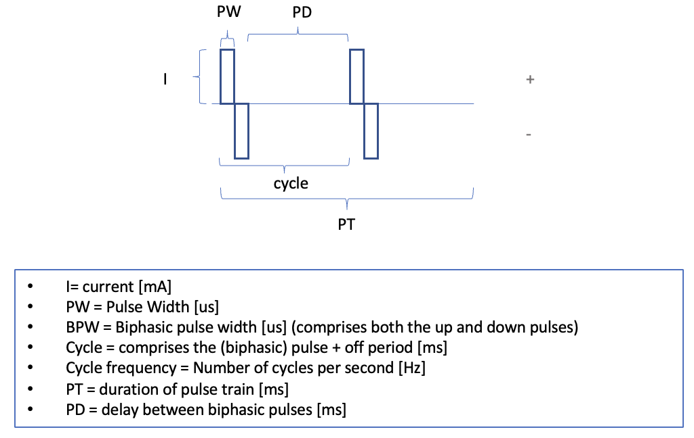

```{r warning=FALSE}
library(tidyverse) 
library(plotly) # for interactive plotting
```


## Aim
This notebook demonstrates the calculation of RMS using the SAE guideline.

## Calculation

### SAE RMS
The SAE RMS formula definition is:
$$
i_{(rms)} = \sqrt{\frac{\int_0^T i(t)^2 dt}{T}} 
$$
Where $$i$$ is the current, and $$T$$ is the size of the window over which the RMS is calculated.


### Pulse-Width Modulation apparent thorughput
Assuming an square signal in a canonical form, the apparent average of a waveform in a cycle T is:
$$
i_{(average)} = D * i_{max}
$$

Where D is the Duty Cycle calculated as the percentage of the time when the waveform is on. Since the waveform is in a canonical squared function, D is simply calculated as:
$$
D = \frac{t_{on}}{t_{cycle}}
$$
Please note that The average of a signal is lower than the RMS.
For **sinusoidal signals**, there is a *form factor* that helps to go from the average to the RMS:






## Example 

### Signal definition




Initializing a variable with the pre-defined parameters characteristics
```{r}
# Parameters
i_amp <- 18   # Instant current amplitude
pulseWidth_PW <- 50 * 1e-06 # parameter in microseconds, resulting value in seconds
pulseNumber_PN <- 20 * 1e-03 # parameter in in milliseconds, resulting value in seconds
electrodeArea <- 1.44  # Area of the electrode in cm^2
samplingRate <- 100000  # in Hz: 100 000 data points every 1 second
pulseTrainDuration_PT <- 2 # in seconds

# Calculated parameters
delayBetweenPulses_PD <- pulseNumber_PN - (2 * pulseWidth_PW) # in seconds
numberPulsesInTrain <- pulseTrainDuration_PT / pulseNumber_PN # it must be an integer result for simplicity

# Wave
currentWave <- rep(
                     c(rep(i_amp, pulseWidth_PW*samplingRate),
                     rep(-i_amp, pulseWidth_PW*samplingRate),
                     rep(0, delayBetweenPulses_PD*samplingRate)),
                   numberPulsesInTrain
                  )

# Timeline
sampleNumber <- c(1:length(currentWave))

# Convert as data frame
currentWave_df <- as.data.frame(sampleNumber)
currentWave_df$currentWave <- currentWave

# Plot wave to verify shape and parameters
plot <- ggplot(data=currentWave_df, aes(x=sampleNumber, y=currentWave)) +
  geom_line(color="blue")
plot <- ggplotly(plot) # Turn to an interactive plot
plot # display the plot
```

### Calculating the RMS per one cycle

Extracting one cycle and plotting it:
```{r}
oneCycleCurrent <- currentWave_df[1:(pulseNumber_PN * samplingRate),]

plot <- ggplot(data=oneCycleCurrent, aes(x=sampleNumber, y=currentWave)) +
  geom_line(color="red")
plot <- ggplotly(plot) # Turn to an interactive plot
plot # display the plot
```


#### Using SAE:
```{r}
SAE_rms_oneCycleCurrent <- sqrt(sum(oneCycleCurrent$currentWave^2) / (pulseNumber_PN*samplingRate))
SAE_rms_oneCycleCurrent

# Which is the same as:
SAE_rms_oneCycleCurrent <- sqrt(mean(oneCycleCurrent$currentWave^2))
SAE_rms_oneCycleCurrent
```

Checking manually, given our knowledge of the waveform:
```{r}
# Squaring after calculating the area:
sqrt( ((2*pulseWidth_PW*i_amp)^2) / (pulseNumber_PN) )

# Squaring sample by sample
sqrt( ((2*pulseWidth_PW*i_amp^2)) / (pulseNumber_PN) )
```
So it seems it is better not to use the area intuition, because it will lead to a different value.

#### Using the duty cycle definition
First, we need to put the wave into a canonical form by taking its absolute value:
```{r}
oneCycleCurrent_abs <- abs(oneCycleCurrent)

# Plot to check the step
plot <- ggplot(data=oneCycleCurrent_abs, aes(x=sampleNumber, y=currentWave)) +
  geom_line(color="red")
plot <- ggplotly(plot) # Turn to an interactive plot
plot # display the plot
```

Calculation according to the aforementioned formula:
```{r}
dutyCycle_D <- (2*pulseWidth_PW) / pulseNumber_PN
PWM_dutyCycleAverageCurrent <- dutyCycle_D * i_amp
PWM_dutyCycleAverageCurrent
```

Checking the transformation from average to RMS:
```{r}
PWM_dutyCycleRMSCurrent <- (1/sqrt(dutyCycle_D)) * PWM_dutyCycleAverageCurrent
PWM_dutyCycleRMSCurrent
```

### Comparison of the formulas to O'connor

O'Connor 2020 used the following formula to calculate the RMS:

$$
i_{rms} = I \sqrt{2 f \tau}
$$
Where I is the amplitude of the current in mA, and the RMS current is also in mA. f is the pulse frequency in Hz, and tau is the phase duration in seconds.

According to the examples they give on pp. 6:

```{r}
# Example 1
currentAmplitude_I <- 100 # in ms
pulseFrequency_f <- 50 # in Hz
phaseDuration_tau <- 500 * 1e-3 # in s
currentRMS_I <- currentAmplitude_I * sqrt(2*pulseFrequency_f*phaseDuration_tau)
currentRMS_I

# Example 2
currentAmplitude_I <- 100 # in ms
pulseFrequency_f <- 20 # in Hz
phaseDuration_tau <- 500 * 1e-3 # in s
currentRMS_I <- currentAmplitude_I * sqrt(2*pulseFrequency_f*phaseDuration_tau)
currentRMS_I
```

In their paper description they say that the answers should be 
